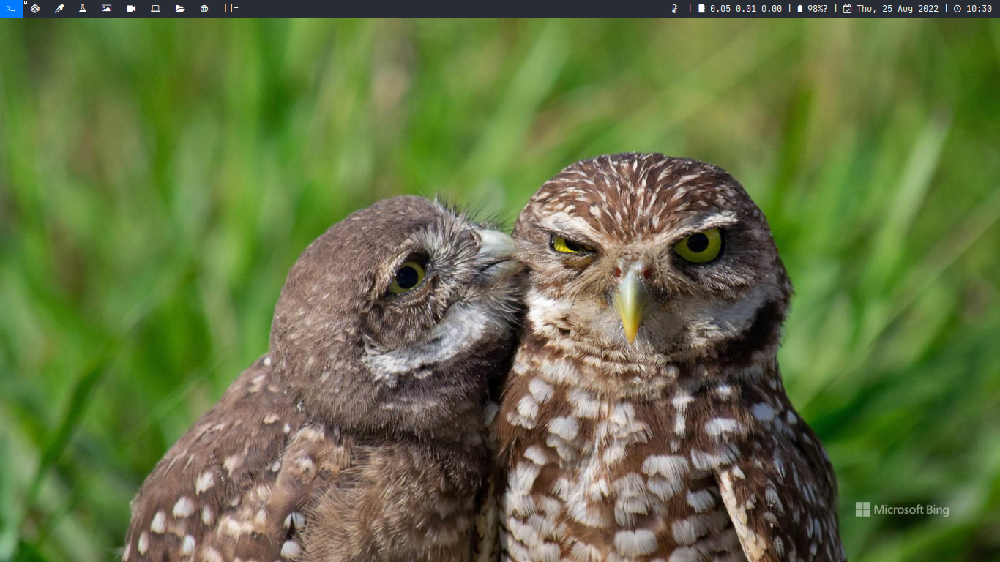

# DWM forked from dwm-distrotube

Dwm is an extremely fast, small, and dynamic window manager for X. Dwm is created by the good folks at [suckless.org](https://suckless.org).  This is my personal build of dwm.  I used a number of patches in this build to make dwm more "sensible" rather than "suckless."

## Clone my other repo to runs the dwm smoothly
```
echo simple-wallpaper alfath-dwm alfath-dwmstatus fonts-cool | xargs -n1 | xargs -I{} git clone https://github.com/alfathmuqoddas/{}
```

## Quickstart
```
sudo apt install sucless-tools feh libx11-dev libxft-dev libxinerama-dev build-essential
echo simple-wallpaper alfath-dwm alfath-dwmstatus fonts-cool | xargs -n1 | xargs -I{} git clone https://github.com/alfathmuqoddas/{}
cd Dowloads
cd alfath-dwm && sudo make clean install
cd alfath-dwmstatus && sudo make clean install
cp dwm.desktop /usr/share/xsessions/
cp autostart.sh ~/.dwm
```

## Ubuntu/Debian Dependencies
``sudo apt install libx11-dev libxft-dev libxinerama-dev build-essential``

## Arch Dependencies
``base-devel``

## Build
``make clean install``

## Things to do after install
- Copy DWM.desktop to ``/usr/share/xsessions/``
- Copy ``autostart.sh`` to ``$HOME/.dwm``
- Install ``feh`` and ``alfath-dwmstatus``
- Clone repo ``simple-wallpaper`` to ``~/Downloads/``

## Main keybindings

| Keybinding              | Action                                                       |
|-------------------------|--------------------------------------------------------------|
| MODKEY + RETURN         | opens terminal (alacritty but can be easily changed)         |
| MODKEY + SHIFT + RETURN | opens run launcher (dmenu but can be changed)                |
| MODKEY + SHIFT + c      | closes window with focus                                     |
| MODKEY + SHIFT + r      | restarts dwm                                                 |
| MODKEY + SHIFT + q      | quits dwm                                                    |
| MODKEY + b              | hides the bar                                                |
| MODKEY + 1-9            | switch focus to workspace (1-9)                              |
| MODKEY + SHIFT + 1-9    | send focused window to workspace (1-9)                       |
| MODKEY + j              | focus stack +1 (switches focus between windows in the stack) |
| MODKEY + k              | focus stack -1 (switches focus between windows in the stack) |
| MODKEY + SHIFT + j      | rotate stack +1 (rotates the windows in the stack)           |
| MODKEY + SHIFT + k      | rotate stack -1 (rotates the windows in the stack)           |
| MODKEY + h              | setmfact -0.05 (expands size of window)                      |
| MODKEY + l              | setmfact +0.05 (shrinks size of window)                      |
| MODKEY + .              | focusmon +1 (switches focus next monitors)                   |
| MODKEY + ,              | focusmon -1 (switches focus to prev monitors)                |

## Layout controls

| Keybinding             | Action                  |
|------------------------|-------------------------|
| MODKEY + d             | row layout              |
| MODKEY + i             | column layout           |
| MODKEY + TAB           | cycle layout (-1)       |
| MODKEY + SHIFT + TAB   | cycle layout (+1)       |
| MODKEY + SPACE         | change layout           |
| MODKEY + SHIFT + SPACE | toggle floating windows |
| MODKEY + t             | layout 1                |
| MODKEY + f             | layout 2                |
| MODKEY + m             | layout 3                |
| MODKEY + g             | layout 4                |

## Application controls

| Keybinding       | Action                                                                       |
|------------------|------------------------------------------------------------------------------|
| MODKEY + ALT + b | open Brave browser                                                           |
| MODKEY + ALT + s | tabbed -r 2 surf -pe x '.surf/html/homepage.html'                            |
| MODKEY + ALT + m | open [mailspring](https://github.com/Foundry376/Mailspring)                  |
| MODKEY + ALT + f | open [pcmanfm (PaCMANFileManager)](https://wiki.archlinux.org/title/PCManFM) |

## Screenshot

