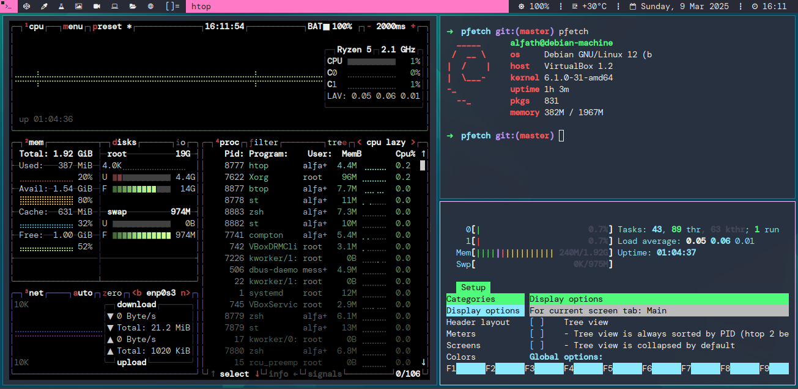
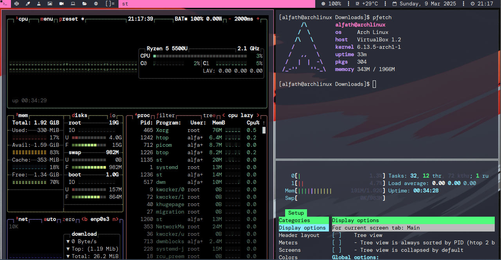

# Alfath DWM 
My modification of Dwm with very little patches to make it more usable.

## List applied patches
1. adjacenttage
2. fullgaps
3. gaps
4. restartsig
5. autostart

## Build Guide
```
# Install build dependencies
sudo apt install build-essential libx11-dev libxft-dev libxinerama-dev libfreetype6-dev libfontconfig1-dev

# clone Repo
git clone -b dev https://github.com/alfathmuqoddas/alfath-dwm

# cd to repo directory
cd alfath-dwm

# Build and install
sudo make clean install

# Copy the autostart script to home/.dwm directory
cp autostart.sh ~/.dwm
```

## Recommended Deps
1. Terminal emulator [alfath-st](https://github.com/alfathmuqoddas/alfath-st1)
2. Dynamic menu [alfath-dmenu](https://github.com/alfathmuqoddas/alfath-dmenu)
3. Display manager lightdm
4. [Nerd fonts](https://www.nerdfonts.com/font-downloads)

## Features
1. dracula color scheme
2. simple and lightweight
3. highly customizeable

## Screenshot



## Apply patch
`patch < patch.diff`

## Credit
1. [Suckless DWM](https://dwm.suckless.org)
